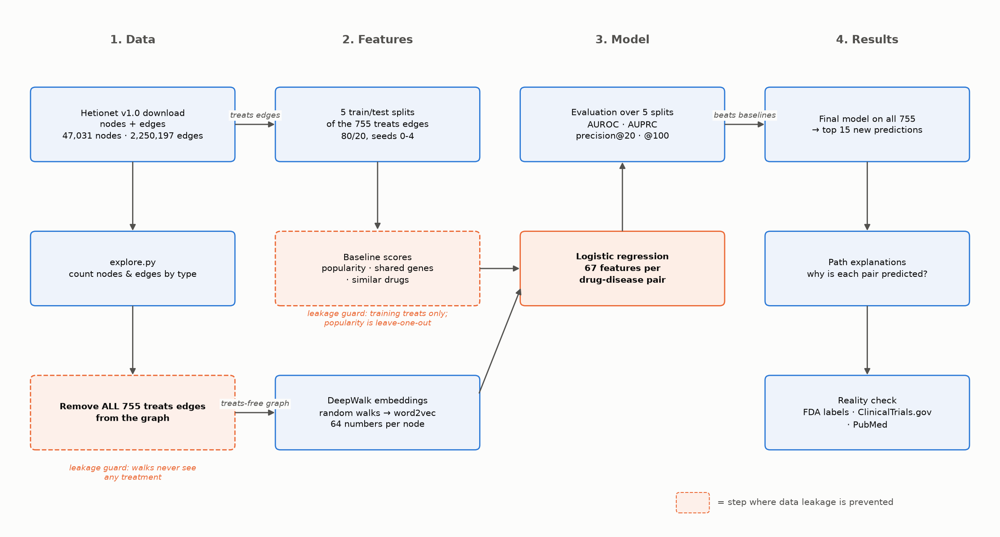
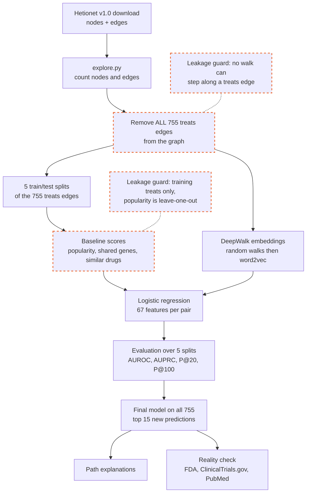
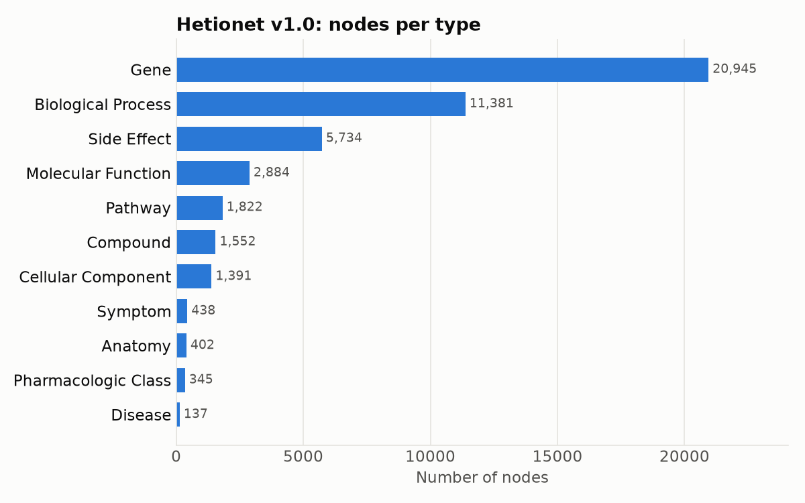
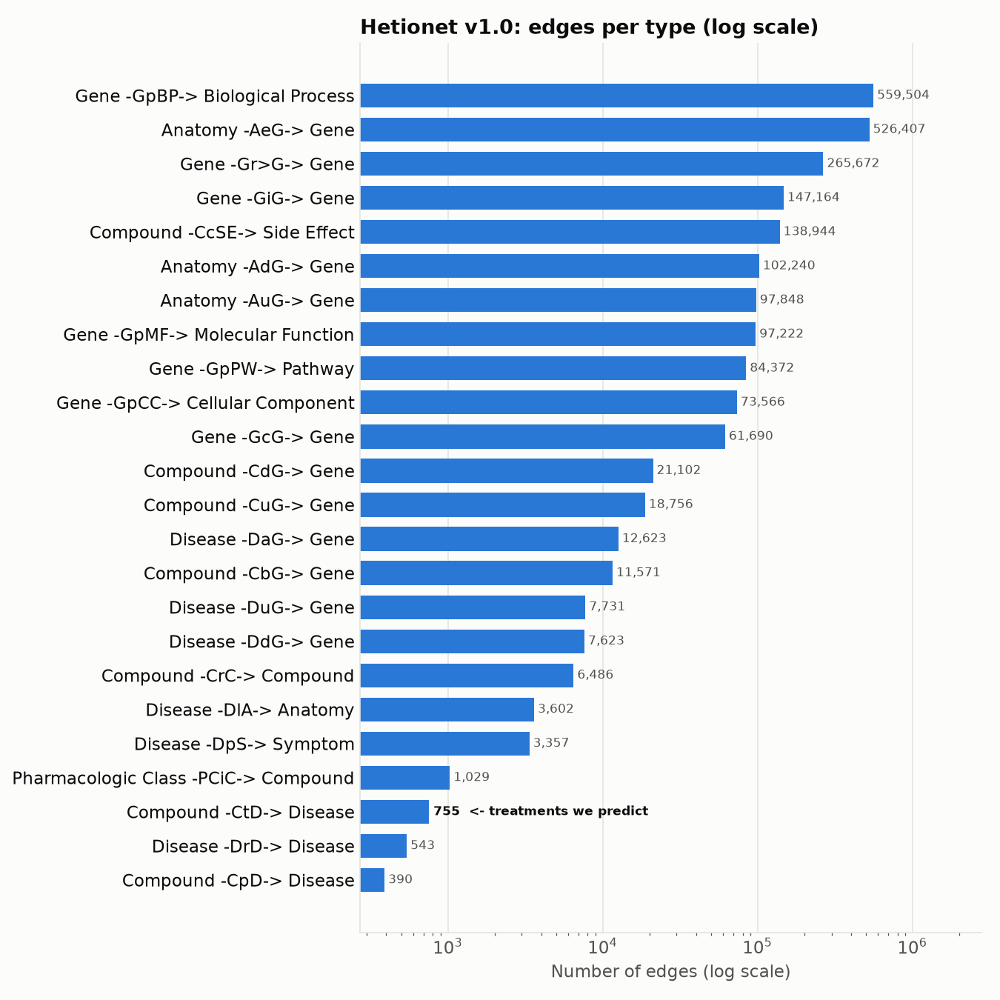
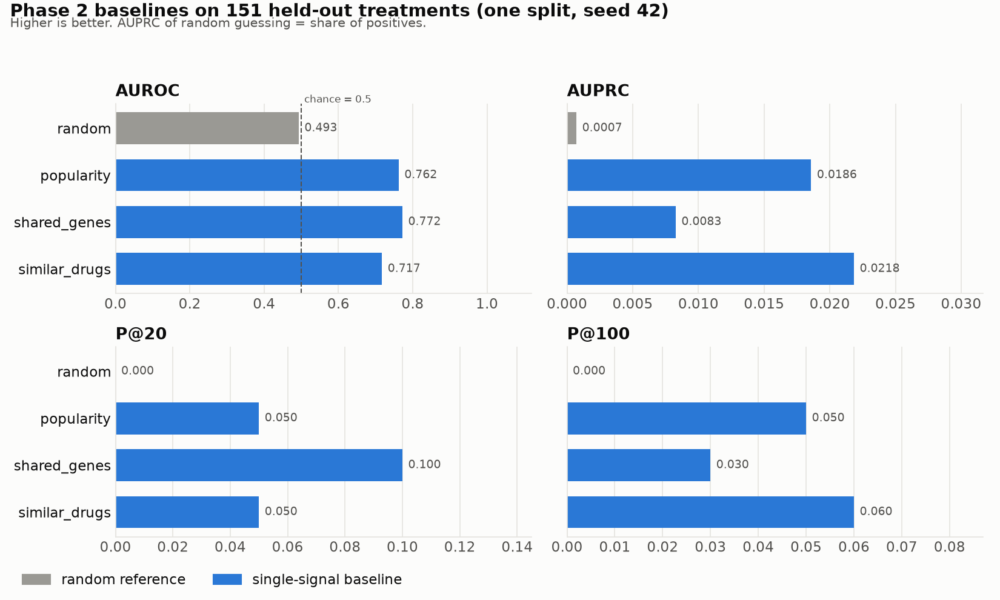
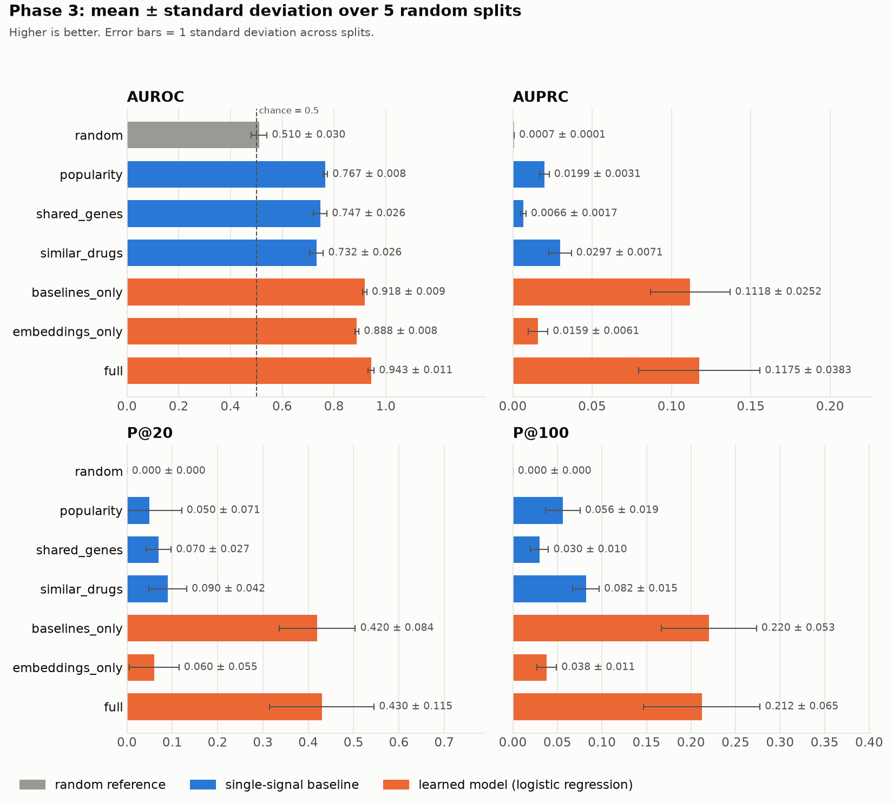
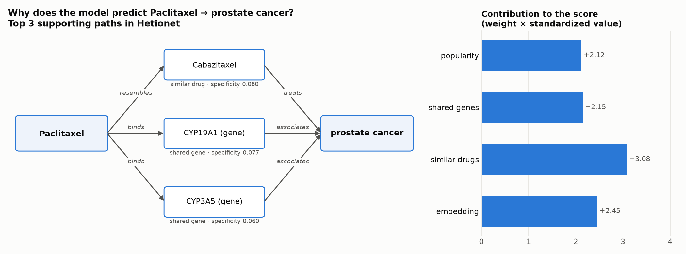

# Drug Repurposing with the Hetionet Knowledge Graph

Can a biomedical knowledge graph point to existing drugs that might treat other diseases? This project predicts Compound–treats–Disease links in Hetionet v1.0. A leakage-safe logistic regression beats a popularity baseline in all 5 random splits (average precision 0.118 vs 0.020). Every top prediction is explained with graph paths and checked against FDA labels, ClinicalTrials.gov and PubMed.



*Pipeline overview. Dashed orange boxes are the steps where data leakage is prevented.*

<details>
<summary>Same pipeline as a Mermaid diagram (renders on GitHub)</summary>



</details>

## The question

Hetionet records 755 known drug treatments ("Compound treats Disease"). If I hide some of them, can a model find them again using only the rest of the graph (genes, pathways, side effects, drug similarity and the remaining treatments)? If it can, its top-ranked *unknown* pairs are candidates for **drug repurposing**: new uses for drugs that are already approved and known to be safe.

## Data

[Hetionet v1.0](https://github.com/hetio/hetionet) (Himmelstein et al., *eLife* 2017) has **47,031 nodes** of 11 types and **2,250,197 edges** of 24 types, integrated from many public biomedical resources. That includes **755 Compound–treats–Disease edges** between 387 drugs and 77 diseases.

**License:** Hetionet's original content is CC0 (public domain). It integrates sources with their own licenses, listed in the [source license table](https://github.com/dhimmel/integrate/blob/d482033bcaa913a976faf4a6ee08497281c739c3/licenses/README.md). The data is downloaded at run time and is not stored in this repository.



*Genes dominate the graph. There are only 1,552 compounds and 137 diseases.*



*Edge counts span three orders of magnitude (log scale). The 755 treats edges are a tiny share of all edges.*

## Method in 5 steps

1. **Split.** Randomly hide 20% of the 755 treats edges as a test set. This is repeated for 5 splits (seeds 0–4). Every Compound × Disease pair that is not a known treatment or palliative use is a candidate, so only about 1 in 1,400 candidate pairs is a real treatment.
2. **Baselines.** Score every pair with three simple counts, computed from *training* treatments only:
   - **popularity:** the drug's number of treatments × the disease's;
   - **shared genes:** genes the drug binds that are associated with the disease;
   - **similar drugs:** chemically similar drugs that treat the disease.
3. **Embeddings.** Learn a 64-number vector for every node with **DeepWalk**: random walks over the graph, fed to word2vec. Nodes that are close in the graph get similar vectors. **All** treats edges are removed first, so the embeddings encode biology only.
4. **Model.** A logistic regression scores each pair from 67 features: the drug vector × disease vector (64) plus the 3 baseline scores. For training positives, popularity is computed *leave-one-out*, so they look like the hidden test pairs. Training negatives are 10 random non-treatment pairs per positive.
5. **Explanations.** Split each top prediction's score into feature contributions (weight × value). List its most specific supporting paths in Hetionet, then check the pair against public sources.

### Baselines (Phase 2, one split)



*On a single split, every baseline beats random, but no single baseline is clearly best. AUROC and AUPRC disagree.*

## Main results (5 random splits, mean ± standard deviation)

| Method | AUROC | AUPRC | P@20 | P@100 |
|---|---|---|---|---|
| random | 0.511 ± 0.030 | 0.0007 ± 0.0001 | 0.00 ± 0.00 | 0.000 ± 0.000 |
| popularity | 0.767 ± 0.008 | 0.0199 ± 0.0031 | 0.05 ± 0.07 | 0.056 ± 0.019 |
| shared genes | 0.747 ± 0.026 | 0.0066 ± 0.0017 | 0.07 ± 0.03 | 0.030 ± 0.010 |
| similar drugs | 0.732 ± 0.026 | 0.0297 ± 0.0071 | 0.09 ± 0.04 | 0.082 ± 0.015 |
| model: baselines only | 0.918 ± 0.009 | 0.1118 ± 0.0252 | 0.42 ± 0.08 | **0.220 ± 0.053** |
| model: embeddings only | 0.888 ± 0.008 | 0.0159 ± 0.0061 | 0.06 ± 0.05 | 0.038 ± 0.011 |
| **model: full** | **0.943 ± 0.011** | **0.1175 ± 0.0383** | **0.43 ± 0.12** | 0.212 ± 0.065 |

*AUPRC = average precision. P@k = share of the top k pairs that are hidden real treatments. Source: [`output/phase3_results.csv`](output/phase3_results.csv).*



*The learned models (orange) far outperform the single-signal baselines (blue) on every metric.*

**What the results say:**

- **The full model beats popularity beyond the noise.** It is better on every metric in **5 of 5 splits**. AUPRC is higher by +0.098 ± 0.037 (paired, per split), and on average 8.6 of its top 20 are hidden treatments.
- **Most of the gain comes from combining the three simple scores**, not from the embeddings. Compared with the baselines-only model, the embeddings raise AUROC in 5 of 5 splits (+0.025 ± 0.009). AUPRC improves in only 3 of 5 (+0.006 ± 0.027), and P@20 and P@100 in only 2 of 5, which is within the noise.
- **AUROC can mislead when positives are rare.** The embeddings-only model has AUROC 0.888 but AUPRC 0.016, below popularity.

## Example prediction explained



*Paclitaxel → prostate cancer: the three most specific Hetionet paths (left) and how each feature group contributed to the score (right).*

| Path type | Path in Hetionet |
|---|---|
| similar drug | Paclitaxel –resembles– Cabazitaxel –treats→ prostate cancer |
| shared gene | Paclitaxel –binds→ CYP19A1 ←associates– prostate cancer |
| shared gene | Paclitaxel –binds→ CYP3A5 ←associates– prostate cancer |

Paclitaxel has been tested in phase II prostate cancer trials (e.g. [NCT00049257](https://clinicaltrials.gov/study/NCT00049257)). All 15 explanations are in [`output/phase4_explanations.md`](output/phase4_explanations.md).

## Reality check of the top 15 new predictions

Each pair was searched in FDA labels (openFDA / DailyMed), ClinicalTrials.gov and PubMed. Every label has a source link in [`output/phase4_reality_check.csv`](output/phase4_reality_check.csv).

| Label | Count |
|---|---|
| already used/approved | 1 |
| in clinical trials | 6 |
| some published evidence | 1 |
| no evidence found | 7 |

- **1 known use missing from Hetionet:** hydrocortisone for leukemias and lymphomas. It is on the FDA label, but as *palliative* care.
- **6 pairs already tested in humans:** daunorubicin and vincristine for breast cancer, paclitaxel for prostate cancer, and three topical steroids for psoriasis. These are mostly close relatives of existing treatments. Topical steroid labels say "corticosteroid-responsive dermatoses" rather than naming psoriasis, so the psoriasis uses may already be standard practice.
- **2 plausible new ideas:** budesonide for atopic dermatitis and estropipate for prostate cancer.
- **6 likely bias or artifacts:**
  - skin-cream steroids predicted for asthma;
  - beta-blocker *eye drops* predicted for blood pressure;
  - a diabetes drug that chemically resembles ACE inhibitors;
  - isoprenaline, which *stimulates* the receptors that beta-blockers block.

## Limitations

- **Popularity bias.** The model favors drugs and diseases that already have many treatments, and drugs that resemble existing treatments. Its top picks are mostly "more of the same".
- **Missing biology in Hetionet.** There is no route of administration (a cream, an eye drop and an inhaler are all just "Compound"). There is no direction of drug action ("binds" doesn't say activate or block). Many "shared gene" paths go through drug-metabolism genes such as CYP3A4 that touch almost every drug.
- **Labels from a single snapshot and single sources.** "Treats" labels are a single 2017 snapshot (Hetionet v1.0). Unlabeled pairs are treated as negatives even though some are unknown treatments. The reality check was done once by hand (on 2026-10-01). "No evidence found" only means these searches found nothing.
- **Small test sets.** About 150 hidden treatments per split, so precision@20 rests on a handful of hits. This is why everything is reported over 5 splits.

## Reproduce from scratch

Requires **Python 3.13** (gensim 4.4 has no Python 3.14 build yet) and about 1 GB of free RAM. The full run takes about 6 minutes on an Apple M3 MacBook Air, mostly embeddings.

```bash
git clone https://github.com/OmKadam16/hetionet-drug-repurposing.git
cd hetionet-drug-repurposing
python3.13 -m venv .venv
.venv/bin/pip install -r requirements.txt
```

Download Hetionet v1.0 (about 14 MB; the edges file is stored with Git LFS):

```bash
mkdir -p data
curl -L -o data/hetionet-v1.0-nodes.tsv https://raw.githubusercontent.com/hetio/hetionet/main/hetnet/tsv/hetionet-v1.0-nodes.tsv
curl -L -o data/hetionet-v1.0-edges.sif.gz https://media.githubusercontent.com/media/hetio/hetionet/main/hetnet/tsv/hetionet-v1.0-edges.sif.gz
```

The edges file's SHA-256 should be `611f0411ac666be4e0270e54bbca67407e14720bfc3099311f0f5eec25c5a947`.

Run the scripts in this order:

```bash
.venv/bin/python src/explore.py     # Phase 1: counts + data charts
.venv/bin/python src/split.py       # Phase 2: train/test split (seed 42)
.venv/bin/python src/baselines.py   # Phase 2: baseline scores and chart
.venv/bin/python src/embed.py       # Phase 3: DeepWalk embeddings (~4-5 min)
.venv/bin/python src/model.py       # Phase 3: 5-split evaluation + top predictions
.venv/bin/python src/explain.py     # Phase 4: explanations report
.venv/bin/python src/diagrams.py    # pipeline + example figures
```

All randomness uses fixed seeds, and word2vec runs on one thread, so reruns reproduce the same CSV results. `output/phase4_reality_check.csv` is curated by hand from public sources, and `explain.py` merges it into the report.

## Project layout

```
src/
  common.py      file paths, seeds, loaders
  plot_style.py  shared chart style
  explore.py     Phase 1: dataset counts and charts
  split.py       Phase 2: train/test split of treats edges
  baselines.py   Phase 2: popularity, shared genes, similar drugs
  embed.py       Phase 3: DeepWalk embeddings on the treats-free graph
  model.py       Phase 3: logistic regression, ablations, 5-split evaluation
  explain.py     Phase 4: feature contributions and supporting paths
  diagrams.py    pipeline and example-explanation figures
output/          results tables, charts and reports (REPORT.md = short write-up)
data/            downloaded data and intermediate files (not in git)
WHAT_I_LEARNED.md  plain-language notes from every phase
```

## Credits and license

Data: Himmelstein DS et al. "Systematic integration of biomedical knowledge prioritizes drugs for repurposing." *eLife* (2017). https://doi.org/10.7554/eLife.26726

Code: MIT License (see [`LICENSE`](LICENSE)).
